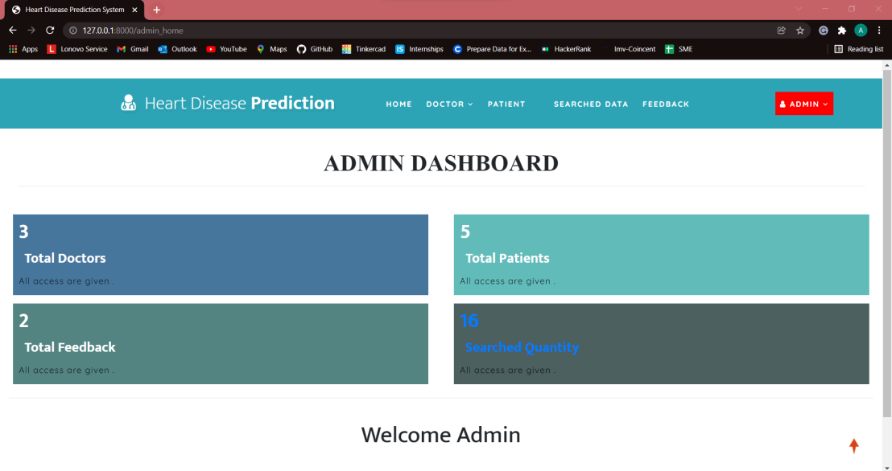
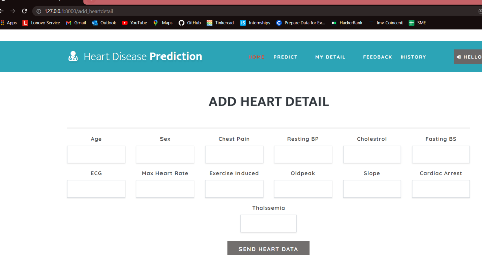
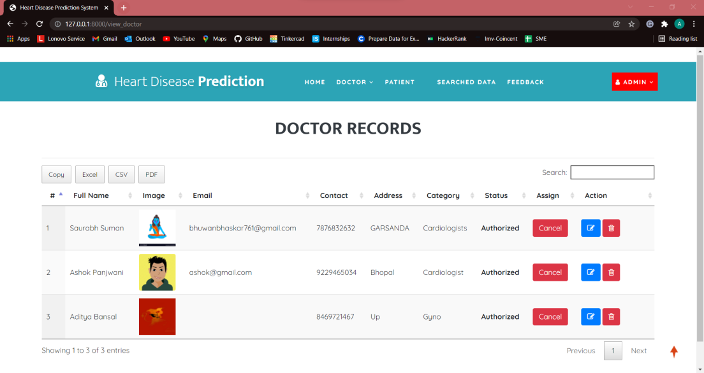
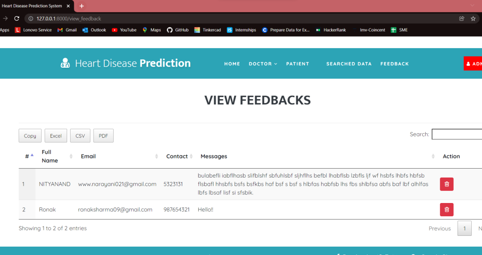

# ❤️ Intelligent Heart Disease Detection System

### Healthcare Prediction Application using Machine Learning

> A Django-based healthcare application that uses **13 clinical parameters** to predict the likelihood of heart disease. The system combines machine learning with patient, doctor, and administrative workflows to make prediction results and healthcare information easier to manage.

<p>
  <a href="https://github.com/Jhanwi/Intelligent-Heart-Disease-Detection-System">💻 GitHub</a>
</p>

---

## 💡 What Problem Does It Solve?

Heart disease risk can be difficult to assess from multiple clinical parameters manually.

This project provides a simple application where users can enter relevant health information and receive a machine-learning-based prediction.

The application also brings related healthcare workflows into one place:

| 👤 Patient            | 👨‍⚕️ Doctor               | 🛠️ Admin               |
| --------------------- | -------------------------- | ----------------------- |
| Register & log in     | Log in securely            | Manage doctors          |
| Enter health details  | View patient details       | Manage patients         |
| Get prediction        | Access patient information | Manage datasets         |
| Search doctors        | —                          | View feedback           |
| View previous records | —                          | Monitor system activity |
| Submit feedback       | —                          | —                       |

---

## ✨ Key Features

### 👤 Patient Portal

Patients can:

* Register and log in
* View personal details
* Enter 13 clinical parameters
* Get heart-disease risk predictions
* View previous prediction records
* Search for doctors by name, address, or type
* Submit feedback

### 👨‍⚕️ Doctor Portal

Doctors can:

* Log in to the system
* View patient information
* Access relevant patient records

### 🛠️ Admin Portal

Administrators can:

* Manage doctor records
* View patient information
* Upload/manage the prediction dataset
* View disease information
* Review user feedback
* Monitor system activity

---

## 🧠 Prediction Workflow

The prediction process follows a simple workflow:

```text
Patient Login
     ↓
Enter Clinical Parameters
     ↓
Validate & Process Input
     ↓
Load Dataset
     ↓
Train Machine Learning Model
     ↓
Generate Prediction
     ↓
Display Result
```

### Clinical Parameters

The model uses **13 parameters**:

```text
Age
Sex
Chest Pain Type
Resting Blood Pressure
Cholesterol
Fasting Blood Sugar
Resting ECG
Maximum Heart Rate
Exercise-Induced Angina
ST Depression
Slope
Number of Major Vessels
Thalassemia
```

These values are processed and passed to the trained machine-learning model to generate the prediction.

> **Note:** The prediction is a machine-learning output for the project and should not be treated as a medical diagnosis.

---

## 🤖 Machine Learning

The application uses **Pandas and Scikit-learn** to process the dataset and train the prediction model.

### Training Process

```text
Dataset
   ↓
Load with Pandas
   ↓
Select 13 Clinical Parameters
   ↓
Train/Test Split (80/20)
   ↓
Gradient Boosting
   ↓
Model Prediction
   ↓
Evaluate on Test Data
```

### Models Used

* **Gradient Boosting Classifier**
* **Logistic Regression**

The current prediction workflow uses the **Gradient Boosting Classifier** with:

* 100 estimators
* Learning rate: 1.0
* Maximum depth: 1
* Random state: 0

The dataset is divided using an **80/20 train-test split**.

---

## 📊 Data Processing

The project uses **Pandas and NumPy** for working with clinical data.

The dataset is loaded from the application's database and converted into a Pandas DataFrame before training.

The workflow includes:

* Dataset loading
* Feature selection
* Data preparation
* Train/test splitting
* Model training
* Prediction
* Model evaluation

---

## 🏥 Healthcare Workflow

The application connects prediction functionality with basic healthcare management:

```text
Patient
   │
   ├── Health Details
   │       ↓
   │   Prediction
   │
   ├── Previous Records
   │
   ├── Doctor Search
   │
   └── Feedback
           ↓
         Admin
```

This makes the project more than a standalone ML script by combining the prediction model with a web-based application and user workflows.

---

## 🏗️ How the System Works

The application follows a Django-based structure:

```text
Web Interface
      ↓
Django Application
      ↓
Prediction & Business Logic
      ↓
Machine Learning Model
      ↓
SQLite Database
```

Each part has a specific responsibility:

* **HTML/CSS/JavaScript** → User interface
* **Django** → Application logic and request handling
* **Python** → Prediction and data processing
* **Scikit-learn** → Machine learning models
* **Pandas / NumPy** → Data processing
* **SQLite** → Patient, doctor, feedback, and dataset records

---

## 🗄️ Database

SQLite stores application data such as:

```text
Users
 ├── Patients
 ├── Doctors
 └── Admin

Healthcare Data
 ├── Patient Details
 ├── Prediction Records
 ├── Doctor Information
 ├── Dataset
 └── Feedback
```

The application retrieves stored data when users need to view previous records or when the prediction workflow requires the training dataset.

---

## 🔐 Application Workflows

The system provides separate workflows for different user roles:

### Patient

```text
Register
  ↓
Login
  ↓
Enter Health Details
  ↓
Get Prediction
  ↓
View Records / Search Doctor
```

### Doctor

```text
Login
  ↓
Access Patient Information
```

### Admin

```text
Login
  ↓
Manage Doctors / Patients / Dataset
  ↓
Review Feedback & System Activity
```

---

## 🛠️ Tech Stack

**Frontend**

`HTML` `CSS` `JavaScript` `Bootstrap`

**Backend**

`Python` `Django`

**Machine Learning**

`Scikit-learn` `Pandas` `NumPy`

**Models**

`Gradient Boosting` `Logistic Regression`

**Database**

`SQLite`

**Development**

`VS Code` `PyCharm` `Git` `GitHub`

---

## 📁 Project Structure

```text
Intelligent-Heart-Disease-Detection-System/
├── Machine_Learning/
├── Screenshots/
├── manage.py
├── db.sqlite3
├── requirements.txt
└── README.md
```

---

## 🚀 Run Locally

### 1. Clone the project

```bash
git clone https://github.com/Jhanwi/Intelligent-Heart-Disease-Detection-System.git
```

### 2. Go to the project directory

```bash
cd Intelligent-Heart-Disease-Detection-System
```

### 3. Install dependencies

```bash
pip install -r requirements.txt
```

### 4. Start the Django server

```bash
python manage.py runserver
```

Open the local application at:

```text
http://127.0.0.1:8000/
```

---

## 🖥️ Application Screenshots

### Welcome Page


### Admin Dashboard



### Health Details & Prediction



### Patient Records


### Doctor Records



### View Feedback



---

## 🎯 What This Project Demonstrates

* Healthcare application development
* Machine learning integration with a web application
* Django application workflows
* Patient and doctor management
* Clinical data processing with Pandas
* Scikit-learn model training and prediction
* SQLite database integration
* User authentication and role-based workflows
* Dataset management
* Troubleshooting across application and data workflows

---

## 🔮 Future Improvements

* [ ] DICOM/image-based medical data support
* [ ] Model versioning and improved evaluation
* [ ] REST API for prediction services
* [ ] Better input validation and error handling
* [ ] Production deployment
* [ ] Automated model retraining
* [ ] More detailed prediction reports
* [ ] Improved monitoring and logging

---

## 👩‍💻 Author

**Jhanwi Kumari**

B.Tech — Computer Science & Engineering

[GitHub Repository](https://github.com/Jhanwi/Intelligent-Heart-Disease-Detection-System)
